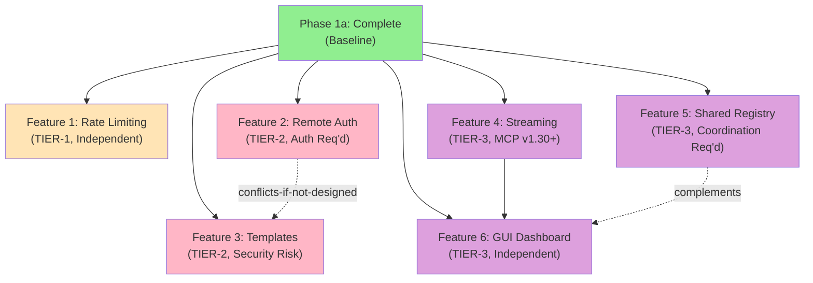

# Phase 2 Discovery: MCP Command Dispatch Enhancements

**Status:** Understand stage complete  
**Confidence:** 85% (requires Architect stage for final scoping)

---

## Executive Summary

Phase 2 planning for MCP Command Dispatch identifies 6 major enhancement candidates deferred from Phase 1a MVP. This document maps dependencies, impact analysis, and prerequisites.

**Phase 1a Status:** ✅ COMPLETE (99% confidence, 606 LOC, 5/5 tests pass, APPROVED)  
**Phase 2 Scope:** Planning & Architecture (not implementation)  
**Timeline:** Post-Phase-1a-merge (v2.3.1 shipped)

---

## Phase 1a Completeness Verification

### What Phase 1a Delivers
- ✅ Core tool: `harness-command-dispatch` MCP tool registered and functional
- ✅ Command resolution: Whitelist-based lookup from adopting project's harness.config.json
- ✅ Execution: spawnSync with 30s timeout (configurable)
- ✅ Audit logging: Immutable JSONL trail to `.github/harness/runs/command-dispatch.jsonl`
- ✅ Error handling: Structured responses with availableCommands on failure
- ✅ Documentation: Adoption guide with examples, jq queries, troubleshooting
- ✅ Test coverage: 5/5 tests pass (positive, negative, non-zero exit, edge case, timeout skip)

### What Phase 1a Does NOT Deliver (Candidates for Phase 2)
- ❌ Streaming output: Commands return full result only (no real-time chunks)
- ❌ Rate limiting: No quota/throttle protection on client calls
- ❌ Shared registry: Commands sourced from individual project config only
- ❌ Remote auth: No per-caller credential validation
- ❌ Template expansion: Commands are static strings, no parameterization
- ❌ UI/Dashboard: No web interface for history/replay/analytics

---

## Phase 2 Candidate Features (Ranked by Dependencies)

### Feature 1: Rate Limiting + Quota Management (TIER-1)
**Dependency Level:** Independent (no prereqs)  
**Complexity:** Medium  
**Risk:** Low (adds gate, doesn't change core behavior)

**What It Does:**
- Throttle incoming dispatch requests per calling client (MCP caller ID)
- Enforce per-project quota limits (e.g., 100 commands/hour)
- Return 429 (Too Many Requests) with retry-after header when limit exceeded
- Log throttle events to audit trail

**Implementation Approach:**
- Sliding window token bucket algorithm (per client ID)
- Store quota state in `.github/harness/runs/quota-state.json` (ephemeral, reset on restart)
- Add config section: `commandDispatch.rateLimit` with defaults
- Extend audit schema: add `quotaRemaining`, `quotaResetAt` fields

**Why Rank 1:** No breaking changes; gate sits before execution; can be deployed independently.

---

### Feature 2: Remote Auth/Credential Scoping (TIER-2)
**Dependency Level:** Requires auth framework (Phase 2 common)  
**Complexity:** High  
**Risk:** High (security-critical, requires proof)

**What It Does:**
- Validate caller identity via MCP caller token/signature
- Scope executed commands to caller's permission set
- Prevent unauthorized commands (e.g., "delete" commands blocked for read-only callers)
- Audit: Record caller identity + permission level in each dispatch record

**Implementation Approach:**
- Define permission model: "executor" (can run all), "auditor" (read-only), "restricted" (specific commands)
- Accept caller token in MCP request context
- Validate against harness RBAC registry (or external auth provider)
- Add to audit: `caller.id`, `caller.permission`, `authorized` flag

**Why TIER-2:** Depends on auth infrastructure not yet in harness. Requires security gate approval. Blocks implementation until resolved.

---

### Feature 3: Command Template Expansion (TIER-2)
**Dependency Level:** Independent (but conflicts with auth if not designed carefully)  
**Complexity:** Medium-High  
**Risk:** Medium (command injection risk if not careful)

**What It Does:**
- Allow parameterized commands: `"test-suite": "npm test -- --filter=${filter}"`
- Caller passes template vars: `--command test-suite --vars '{"filter":"unit"}'`
- Harness resolves vars and executes: `npm test -- --filter=unit`
- Validate var names against whitelist; reject unknown vars

**Implementation Approach:**
- Command definition includes optional `vars` array: `["filter", "timeout"]`
- Request includes `vars` object: `{filter: "unit", timeout: "30"}`
- Pre-execution: Substitute `${varName}` in command string; validate all required vars provided
- Audit: Log resolved command + var substitutions

**Why TIER-2:** Medium complexity but creates new attack surface if not careful. Requires security review before implementation.

---

### Feature 4: Real-Time Streaming Output (TIER-3)
**Dependency Level:** Requires MCP resource_chunk protocol support (MCP v1.30+)  
**Complexity:** High  
**Risk:** Medium (streaming adds state management complexity)

**What It Does:**
- Send command stdout/stderr in real-time chunks (not buffered full output)
- MCP client receives partial results as command runs
- Enables long-running commands (e.g., tests) without blocking MCP connection timeout
- Chunks include: `{timestamp, index, data, status: "running|success|failure"}`

**Implementation Approach:**
- Detect MCP client capability: `streaming: true` in request
- If streaming supported: Use spawnSync with streaming handlers (Node streams)
- Send MCP resource_chunk messages as output arrives (or buffer 1s intervals)
- Final chunk includes exitCode + full audit record
- If streaming not supported: Fallback to Phase 1a buffered response

**Why TIER-3:** MCP protocol dependency (v1.30+, not current). Requires MCP client upgrades to adopt. State management complexity. Candidate for Phase 2b (post-v2.4).

---

### Feature 5: Cross-Project Shared Command Registry (TIER-3)
**Dependency Level:** Requires shared registry service (external or harness-hosted)  
**Complexity:** High  
**Risk:** Medium (coordination complexity, registry sync)

**What It Does:**
- Adopting projects register commands to central harness registry
- Other projects discover and call registered commands: `--project-ref=other-repo --command build`
- Enables cross-project orchestration (e.g., monorepo builds)
- Registry includes: command signature, owner project, permissions, SLA

**Implementation Approach:**
- Central registry: Git-backed YAML file in harness-kit (`.github/registry/commands.yaml`) or external (Redis, etc.)
- Command namespace: `{project}:{command}` (e.g., `frontend:build`, `backend:test`)
- Adopting project registers: `harness.config.json` + registry sync step
- Dispatch request: `--project-ref frontend --command build`
- Harness resolves project location (clone/remote call) and executes

**Why TIER-3:** Requires distributed coordination. Network/sync complexity. State consistency challenges. Phase 2b candidate (post shared infra decisions).

---

### Feature 6: GUI Dashboard for Command History/Replay (TIER-3)
**Dependency Level:** Independent (but needs streaming + audit data)  
**Complexity:** Medium (web UI + backend API)  
**Risk:** Low (additive, doesn't change core)

**What It Does:**
- Web interface showing audit trail (`.github/harness/runs/command-dispatch.jsonl`)
- Display: Command name, caller, timestamp, exit code, elapsed time, output snippet
- Features: Filter (by command/caller/status), search, export CSV
- Replay: Re-run selected command with same params (requires auth + approval)

**Implementation Approach:**
- Backend: Express.js API serving audit trail + command metadata
- Frontend: React/Vue dashboard (charts, table, search)
- Served at: `http://localhost:3000/harness/commands` (dev) or `https://<harness>/commands` (prod)
- Data source: Read-only access to `.github/harness/runs/command-dispatch.jsonl`
- Replay: Trigger new dispatch request with historical params

**Why TIER-3:** Purely additive feature. Low risk. Can be built after other features. Phase 2b or even Phase 3 candidate.

---

## Dependency Graph

---

## Impact Analysis (Blast Radius)

### Code Changes Required

| Feature | mcp-tools.mjs | mcp-server.mjs | mpc-audit.mjs | mcp-contracts.mjs | harness.config.json | New Files |
|---------|--------------|----------------|---------------|-------------------|-------------------|-----------|
| Rate Limit | +50 LOC | +30 LOC | +20 LOC (quota fields) | +10 LOC | +15 LOC | quota-manager.mjs |
| Remote Auth | +100 LOC | +50 LOC | +30 LOC (auth fields) | +20 LOC | +20 LOC | auth-validator.mjs |
| Templates | +80 LOC | +20 LOC | +10 LOC | +5 LOC | +20 LOC | template-resolver.mjs |
| Streaming | +150 LOC | +100 LOC | +40 LOC | +30 LOC | +10 LOC | stream-handler.mjs |
| Shared Registry | +200 LOC | +100 LOC | +50 LOC | +40 LOC | +30 LOC | registry-client.mjs, commands.yaml |
| GUI Dashboard | 0 LOC | +200 LOC (API) | 0 LOC | 0 LOC | +20 LOC | dashboard/ (React) |

### Risk Assessment

| Feature | Backward Compat | Security Risk | Test Coverage | Complexity |
|---------|-----------------|----------------|----------------|-----------|
| Rate Limit | ✅ Yes (gate before execution) | 🟡 Medium (quota spoofing) | Medium (load tests) | Low |
| Remote Auth | ❌ No (requires caller info) | 🔴 High (auth bypass risk) | High (unit + integration) | High |
| Templates | ⚠️ Partial (opt-in) | 🔴 High (injection risk) | High (fuzzing) | Medium |
| Streaming | ✅ Yes (fallback to buffered) | 🟡 Medium (resource exhaustion) | Medium (stress tests) | High |
| Shared Registry | ❌ No (new semantics) | 🟡 Medium (registry consistency) | Medium (sync tests) | High |
| GUI Dashboard | ✅ Yes (read-only) | 🟡 Medium (data exposure) | Low (UI tests) | Medium |

---

## Prerequisites (Before Phase 2 Implementation)

### Infrastructure Required

1. **Auth Framework** (for Features 2 & 3)
   - RBAC model definition (roles: executor, auditor, restricted)
   - Token validation mechanism (JWT, Harness RBAC API, etc.)
   - Caller context extraction from MCP request

2. **MCP Protocol Upgrade** (for Feature 4)
   - Verify harness MCP server supports MCP v1.30+ (resource_chunk protocol)
   - Test client compatibility (Cline, Claude, etc.)

3. **Registry Infrastructure** (for Feature 5)
   - Decision: Git-backed (YAML in repo) vs. centralized service (Redis, etc.)
   - Registry schema & validation rules
   - Project onboarding workflow

4. **Frontend Stack** (for Feature 6)
   - Choose: React, Vue, or server-side rendering (EJS, etc.)
   - Setup: Package.json, build pipeline, dev server
   - Hosting: Local (dev) vs. production URL

### Documentation & Design Decisions

1. **Security Architecture** (for Features 2, 3)
   - Threat model: Command injection, privilege escalation, quota bypass
   - Approval gate: Proof of penetration testing
   - Compliance: RBAC audit trail, logging requirements

2. **API Contracts** (for Features 4, 5)
   - Streaming response schema (chunk format, error handling)
   - Registry API (list, register, discover commands)
   - Version negotiation (client capabilities)

3. **Testing Strategy**
   - Load tests for rate limiting (quota exhaustion scenarios)
   - Fuzz tests for template expansion (injection attacks)
   - Integration tests for shared registry (consistency, sync)
   - E2E tests for streaming (partial failures, reconnection)

---

## Proposed Phase 2 Roadmap

### Phase 2a: Foundation (v2.4, Q3 2026)
**Goal:** Ship rate limiting + auth framework + foundational work  
**Duration:** 3-4 weeks  
**Deliverables:**
- ✅ Rate limiting + quota management (Feature 1)
- ✅ Remote auth framework (Feature 2 - base, not feature-complete)
- ✅ Template expansion (Feature 3 - with security proofs)
- 📋 Shared registry design (Feature 5 - architecture only, no impl)

**Release:** v2.4.0-beta

### Phase 2b: Advanced (v2.5, Q4 2026)
**Goal:** Ship streaming + shared registry + polish  
**Duration:** 4-5 weeks  
**Deliverables:**
- ✅ Streaming output (Feature 4)
- ✅ Shared registry (Feature 5 - MVP implementation)
- ✅ GUI dashboard (Feature 6)
- ✅ Cross-feature integration tests

**Release:** v2.5.0

### Phase 2c: Optimization (v2.6, 2027)
**Goal:** Performance, reliability, observability  
**Duration:** TBD  
**Candidates:**
- Audit log rotation + archival
- Rate limit analytics + dashboards
- Template caching + performance tuning
- Multi-region registry replication

---

## Known Risks & Mitigations

| Risk | Severity | Mitigation |
|------|----------|-----------|
| Auth framework delays | HIGH | Define minimal auth model (3 roles max); defer advanced features to Phase 3 |
| Command injection via templates | CRITICAL | Fuzzing + penetration test req'd before ship; whitelist var names only |
| Quota spoofing (distributed clients) | MEDIUM | Use caller token + signing; log all requests; implement SLA monitoring |
| Streaming client incompatibility | MEDIUM | Fallback to buffered mode; version negotiation in protocol handshake |
| Registry sync/consistency issues | MEDIUM | Start with Git-backed registry (simpler); move to service-based in Phase 3 |
| Dashboard data exposure | MEDIUM | Read-only access; optional auth gate (inherit from parent harness) |

---

## Open Questions (For Architect Stage)

1. **Rate Limiting Storage:** Ephemeral (in-memory, reset on restart) vs. persistent (Redis/file)?
2. **Auth Model:** Harness RBAC vs. JWT tokens vs. external auth provider?
3. **Templates:** Allow only alphanumeric vars or support complex expressions?
4. **Streaming:** Full real-time chunks (CPU intensive) or 1s batches (simpler)?
5. **Registry:** Git-backed YAML vs. dedicated registry service?
6. **Dashboard:** Standalone React app vs. embedded in harness (no new UI framework)?

---

## Next Steps (Architect Stage)

This Understand stage identifies scope, dependencies, and risks. The **Architect stage** will:

1. Make decisions on open questions (1-6 above)
2. Produce Architecture Brief for each feature (separate briefs for Phase 2a features)
3. Define implementation order + critical path
4. Identify blockers + prerequisite work
5. Finalize timeline + resource allocation

**Recommended:** Architect stage should separate Phase 2a (rate limit, auth, templates) from Phase 2b (streaming, registry, dashboard) as distinct briefs.

---

**End of Understand Stage**

Status: ✅ Complete  
Next: Architect stage (GPT-5.6-Luna)
